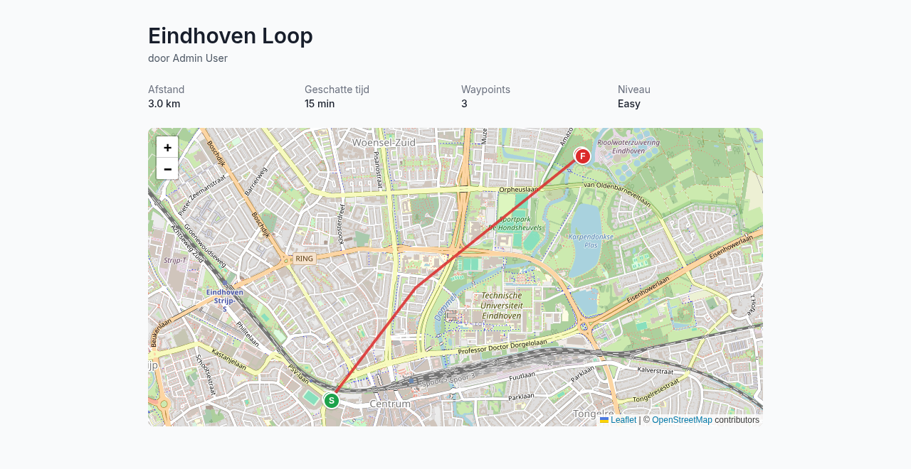
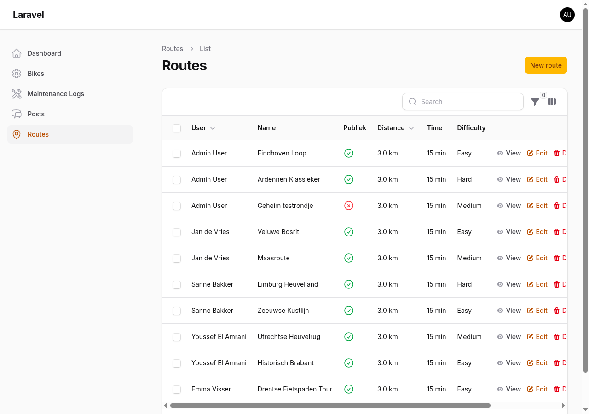
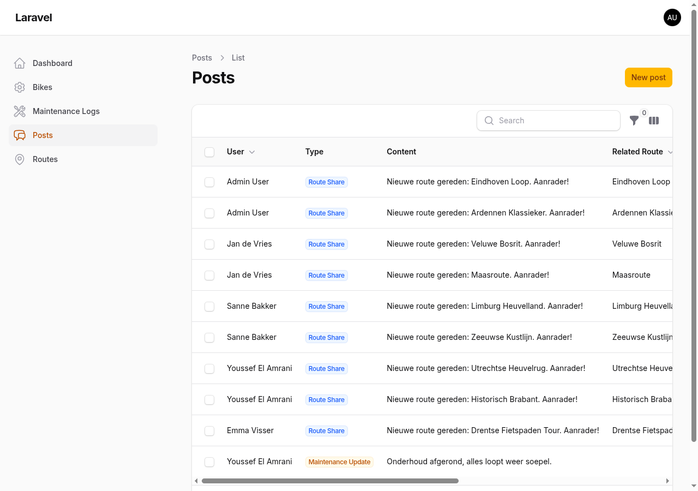

# MotoTrax 🏍️

A motorcycle community platform built with Laravel 13 + Filament v5, featuring GPX routes, maintenance logs, and social features.

## 🚀 Features

- **Motorcycle Management**: Add and manage your motorcycles with photos and specifications
- **Maintenance Tracking**: Keep detailed logs of all maintenance work and costs
- **GPX Routes**: Upload, share, and discover motorcycle routes
- **Social Feed**: Connect with other riders, share experiences
- **Admin Panel**: Complete Filament admin interface
- **API Ready**: RESTful API endpoints for mobile apps

## 🎬 Demo

Spin up the full stack with a seeded demo dataset (5 users, 9 bikes, 10 GPX routes, a live feed) in a few commands. Full walkthrough: **[docs/MotoTrax/deploy.md](docs/MotoTrax/deploy.md)**.

Demo login: `admin@mototrax.dev` / `password` (admin) — riders `jan|sanne|youssef|emma@mototrax.dev`, all `password`.

## 📸 Screenshots

**Route detail met interactieve kaart** (Leaflet + OpenStreetMap, GPX-track met start/finish):



**Admin — routes** (Filament) &nbsp;·&nbsp; **Admin — feed/posts**

| Routes | Feed |
|--------|------|
|  |  |

## 🐳 Docker Setup

### Quick Start

1. **Clone and setup:**
   ```bash
   git clone <repository>
   cd mototrax
   ```

2. **Start containers:**
   ```bash
   docker-compose -f docker-compose.yml -f docker-compose.override.yml up -d --build
   ```

3. **Run migrations and seed the demo data:**
   ```bash
   docker-compose exec app php artisan migrate:fresh --seed --force
   ```

4. **Access the application:**
   - Web App: http://localhost:18081
   - Admin Panel: http://localhost:18081/admin
   - Database: localhost:5433

> For a complete, reproducible demo bring-up (env, credentials, dataset, reset & troubleshooting) see **[docs/MotoTrax/deploy.md](docs/MotoTrax/deploy.md)**.

### Custom Ports

If you have multiple Docker apps running:

1. Copy the example configuration:
   ```bash
   cp docker-compose.local.yml.example docker-compose.local.yml
   ```

2. Edit `docker-compose.local.yml` to change ports

3. Start with custom ports:
   ```bash
   docker-compose -f docker-compose.yml -f docker-compose.local.yml up -d --build
   ```

## 🔧 Development

### Local Development Setup

1. **Install dependencies:**
   ```bash
   composer install
   npm install
   ```

2. **Environment setup:**
   ```bash
   cp .env.example .env
   php artisan key:generate
   ```

3. **Database setup:**
   ```bash
   php artisan migrate
   php artisan db:seed
   ```

4. **Start development server:**
   ```bash
   php artisan serve
   ```

### Default Credentials

- **Admin User**: admin@mototrax.dev / password
- **Database**: mototrax_user / mototrax_password

## 📊 Database Schema

- **Users**: Authentication and profiles
- **Bikes**: Motorcycle details and images
- **Maintenance Logs**: Service records and costs
- **Routes**: GPX files with metadata
- **Posts**: Social feed content

## 🛣️ GPX Features

- Upload GPX files up to 10MB
- Route metadata (distance, time, difficulty)
- Tag-based categorization
- Download and sharing capabilities

## 🧰 Tech Stack

- **Backend**: Laravel 13 + PHP 8.4
- **Frontend**: Filament v5 + Blade
- **Database**: PostgreSQL 15
- **Containerization**: Docker + Docker Compose
- **Web Server**: Nginx
- **Authentication**: Laravel Sanctum

## 📱 API Endpoints

All API routes are versioned under `/api/v1` and protected with Sanctum (rate-limited, CORS-aware). See the Postman collection in [`docs/MotoTrax/api/`](docs/MotoTrax/api/).

- `/api/v1/user` - Authenticated user profile
- `/api/v1/users` - Riders directory
- `/api/v1/bikes` - Motorcycle management
- `/api/v1/routes` - Route discovery (`/routes/{route}/gpx` for GPX download)
- `/api/v1/posts` - Social posts
- `/api/v1/feed` - Timeline feed
- `/api/v1/notifications` - Rider notifications

## 🤝 Contributing

1. Fork the repository
2. Create a feature branch
3. Make your changes
4. Run tests and ensure code quality
5. Submit a pull request

## 📝 License

This project is open-sourced software licensed under the MIT license.

## 🆘 Support

For issues and questions:
- Check the [Docker Setup Guide](README-Docker.md)
- Review the GitHub Issues
- Contact the development team

---

Built with ❤️ for the motorcycle community
